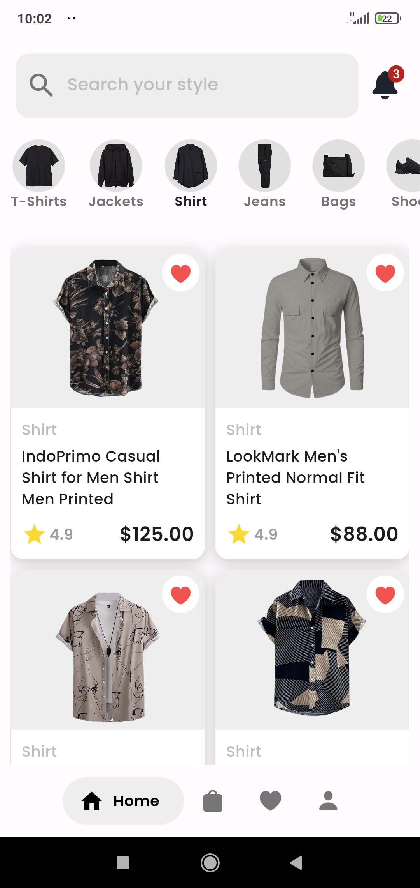
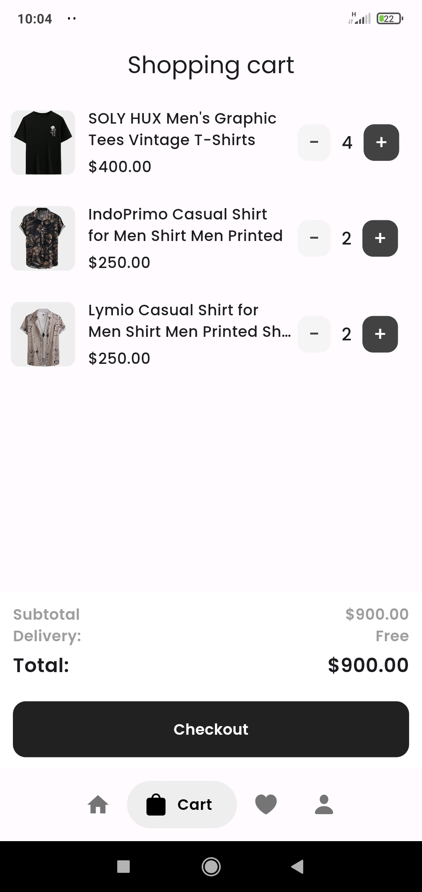

<h1 align="center">Ecommerce BeliBeli (Mobile)</h1>

<p align="center">
  
  
  
</p>


## Description

An e-commerce project to sell products online.

## Screenshots


<br />

Login                      |   Home screen             |  Product Detail Screen    
:-------------------------:|:-------------------------:|:-------------------------:
||

<br />

Cart Screen                |   Checkout                
:-------------------------:|:-------------------------:
|

## Installation

1. Clone the repository

```bash
git clone https://github.com/RamirezPineda/mobile_belibeli.git
```

2. Navigate to the application directory:

```bash
cd mobile_belibeli
```
3. Install the project dependencies:

```bash
flutter pub get
```

## Configuration

Rename the .env.example file to .env and set the environment variables

```bash
# before
|--src
|--lib
|--.env.example
...
...
...
|--pubspec.yaml

# after
|--src
|--lib
|--.env
...
...
...
|--pubspec.yaml
```

## Running the app

```bash
flutter run
```
